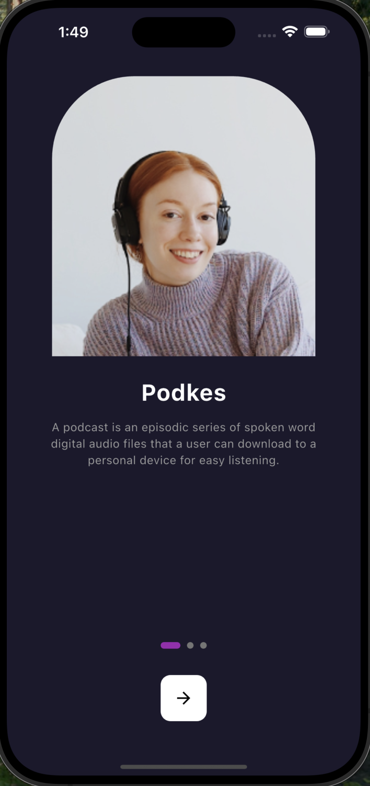
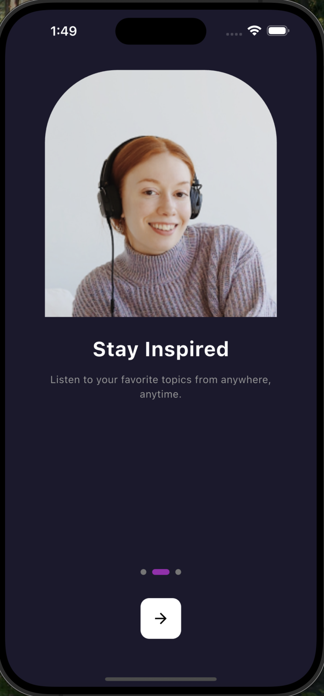
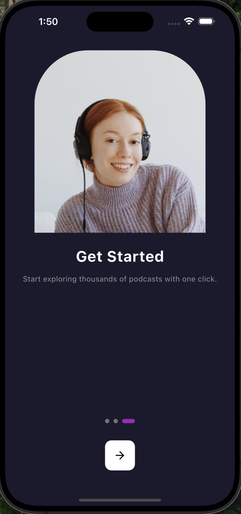
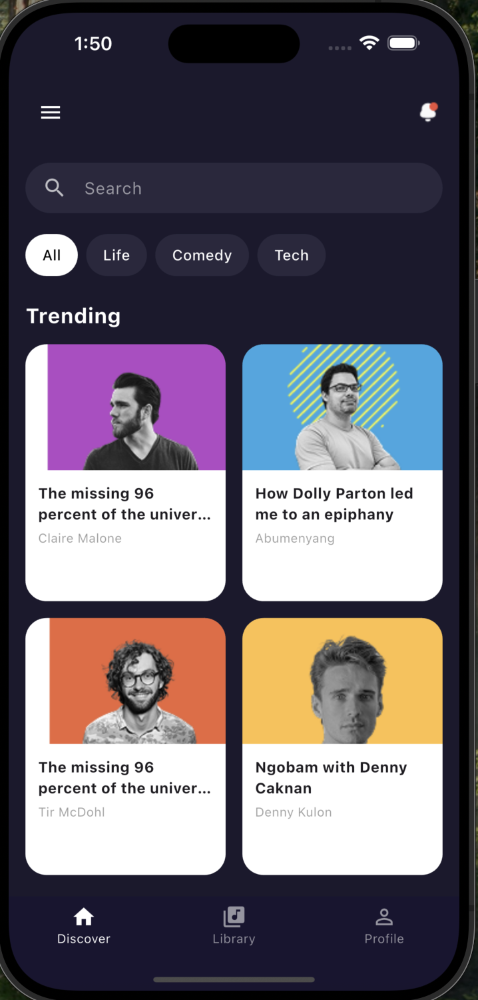
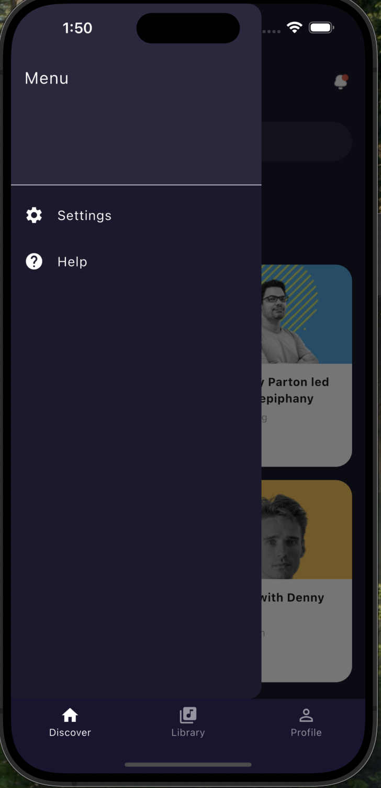
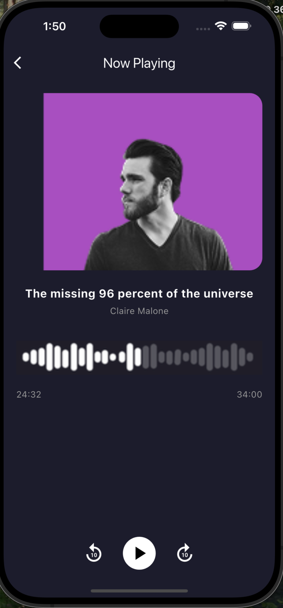
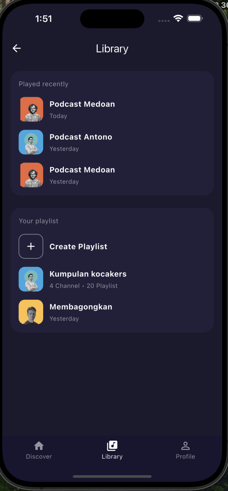
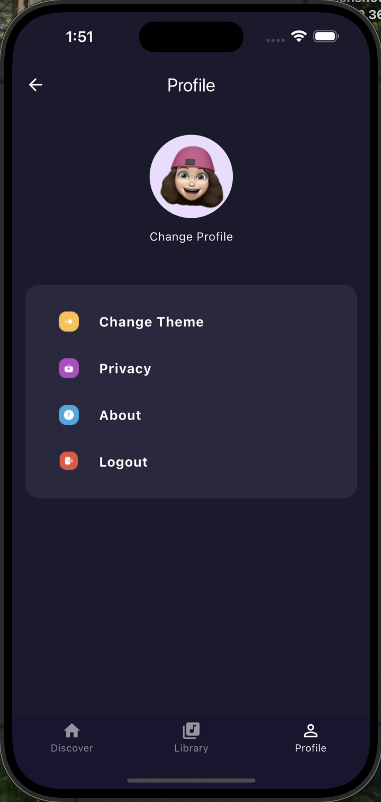
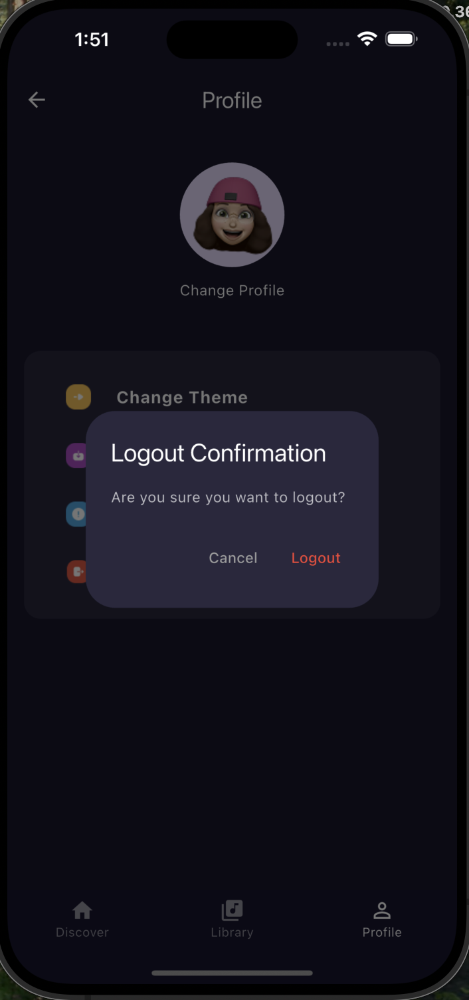

# 🎧 Podkes - Flutter Podcast UI App

This is a Flutter application that replicates the **Podkes** podcast app UI, inspired by the provided Figma design.

## 📱 Screens Included

- Getting Started (with PageView navigation and indicators)
- Discover (with grid layout and dynamic navigation)
- Now Playing (modern podcast UI layout)
- Library (Recently Played and Playlist section)
- Profile (with option tiles and logout alert)

## 📂 Project Structure

```bash
lib/
│
├── main.dart
├── utils/
│   └── dialog_util.dart   
├── widgets/
│   ├── podcast_card.dart             
│   └── shimmer_card.dart           
├── screens/
│   ├── discover_screen.dart
│   ├── getting_started_screen.dart
│   ├── home_screen.dart
│   ├── library_screen.dart
│   ├── now_playing_screen.dart
│   └── profile_screen.dart


💡 Features

BottomNavigationBar with 3 sections
PageView onboarding with bar-style indicator
Custom podcast cards and shimmer effect
Drawer in Discover & Library
AlertDialog on logout


🚀 Getting Started

1- Clone the repo:
git clone https://github.com/yourusername/podkesapp.git
cd podkesapp
2- Get dependencies:
flutter pub get
Run the app:
flutter run

3- 🧩 Dependencies
shimmer

4- ## 📸 Screenshots

### Getting Started (Onboarding)
<p float="left">
  
  
  
</p>

### Home


### Navigation Menu (Drawer)


### Now Playing


### Library


### Profile


### Dialog (Logout Confirmation)



👩🏻 Author
  Ameerah Aloufi.


